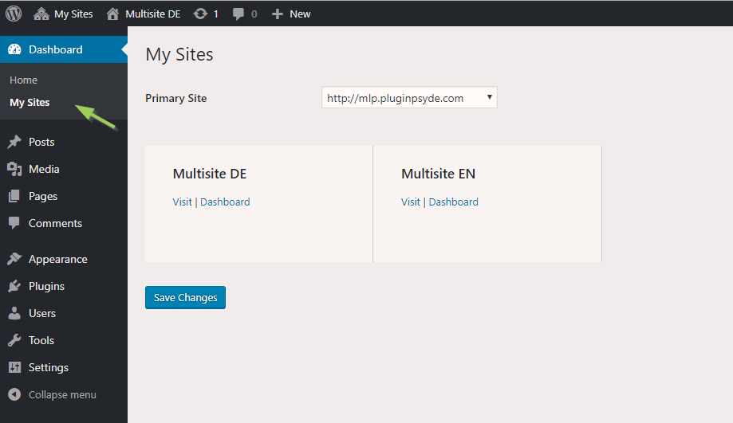

- now that we've got multiple sites and users, the old UI isn't enough (we need at least a user
management screen to reset/delete) - unless there's a better pattern the Wordpress method
seems 'okay' (although i don't like it much - if you got a better design feel free)

- under this set up, we need to see our 'subusers' (i.e. - users on sites we're admin on or
all for the superuser of the root site), be able to reset or set their passwords
- each subsite also needs a field to add the google analytics (unless this can be done from 
the service itself?  seems a lot of data for sqlite)
- sites need a fixed header bar like the primary admin (image below) with the site name (and maybe move
the floating admin link in the footer can change to a 'Login' button there)

- 
- an editable copyright for each site that appears on the footer for each page would be a nice touch
- a column control in the editor would go a long way toward making this really powerful, see this
image of our current (wordpress) camp site, we'd like to be able to make columns of buttons, text and images

