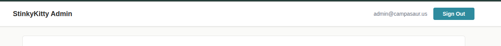

- edit users throwing a new sql error:
025/12/29 12:16:16 /home/lpreimesberger/projects/mex/stinkycat/internal/handlers/admin_users.go:61 DISTINCT aggregates must have exactly one argument
[0.094ms] [rows:-] 
                        SELECT u.id, u.email, u.created_at,
                                   GROUP_CONCAT(DISTINCT s.subdomain, ' | ') as sites,
                                   CASE
                                           WHEN COUNT(DISTINCT CASE WHEN s.owner_id = u.id THEN s.id END) > 0 THEN 'owner'
                                           WHEN MAX(su.role) = 'admin' THEN 'admin'
                                           ELSE 'member'
                                   END as role
                        FROM users u
                        LEFT JOIN site_users su ON u.id = su.user_id
                        LEFT JOIN sites s ON su.site_id = s.id OR s.owner_id = u.id
                        WHERE u.deleted_at IS NULL
                        GROUP BY u.id
                        ORDER BY u.email

 
- CSS on the header is a bit weird, we want something like this:

- but got this:

- 
- column is nice for text, but can we support embedded iamges and button like this:

