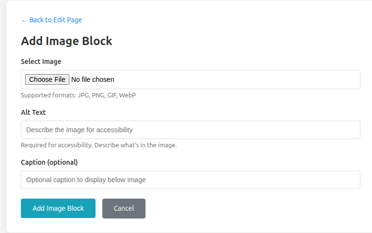

- update Add Image Block to select from media library

- add uploaded files to media library (today orphaned)
- tag uploaded media as belonging to a site
- add 'resize on upload' to media - put max upload size slider and max image size slider on media library page - max upload should be ~15MB, max image size should be ~1024px
- add certificate management to main admin page (is Lets Encrypt working okay?  when do we renew)
- there are errors in the logs about certificate management - this important?

1.7671979999638228e+09  error   maintenance     unable to get configuration to manage certificate; unable to renew      {"identifiers": ["thatcatcamp.campasaur.us"], "error": "config returned for certificate [thatcatcamp.campasaur.us] has nil cache; expected 0xc000348380 (this one)"}
1.7671979999638345e+09  error   maintenance     unable to get automation config for certificate; maintenance for this certificate will likely fail      {"identifiers": ["campasaur.us"], "error": "config returned for certificate [campasaur.us] has nil cache; expected 0xc000348380 (this one)"}
1.7671979999638445e+09  error   maintenance     unable to get automation config for certificate; maintenance for this certificate will likely fail      {"identifiers": ["main.campasaur.us"], "error": "config returned for certificate [main.campasaur.us] has nil cache; expected 0xc000348380 (this one)"}
1.7671979999638574e+09  error   maintenance     unable to get automation config for certificate; maintenance for this certificate will likely fail      {"identifiers": ["test2.campasaur.us"], "error": "config returned for certificate [test2.campasaur.us] has nil cache; expected 0xc000348380 (this one)"}
1.7671979999638684e+09  error   maintenance     unable to get automation config for certificate; maintenance for this certificate will likely fail      {"identifiers": ["thatcatcamp.campasaur.us"], "error": "config returned for certificate [thatcatcamp.campasaur.us] has nil cache; expected 0xc000348380 (this one)"}
